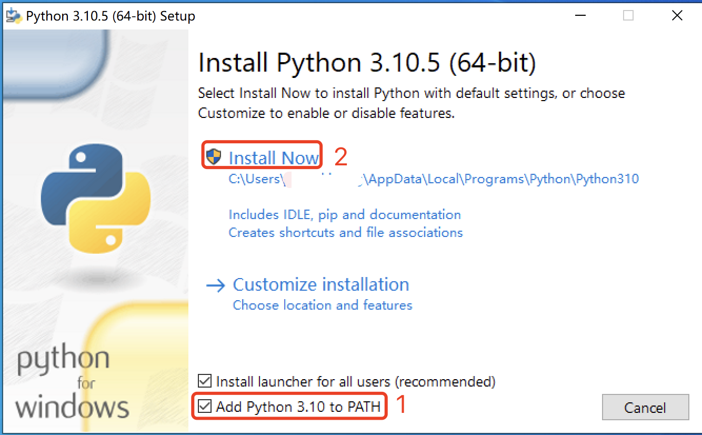

## 西班牙签证位置监听 (base英国)
### 一、简介
回国需要申根签，但是每天蹲网站刷slot太浪费时间了，故写了一个监听脚本。分享给在🇬🇧有需要的同学。

项目是基于 [one-focus/visa-spain](https://github.com/one-focus/visa-spain) 改的，抽出了关键代码，针对英国的BLS的网站改了一下。请不要拿来用作盈利用途，否则会追究责任。

在python3.6 + macOS Catalina，python 3.9 + macOS Monterey，Windows 10，Windows 11上运行成功，没在别的环境上做过测试。

#### 功能

如果放了签证预约空位，电脑会自动语音通知你。目前只通知日期，不会精确到小时，但个人用途足矣。


### 二、文件介绍
```text
.
├── monitor.py         # starter
├── visa.py            # modify xpath for UK BLS
├── utils
│   ├── basic.py       
│   ├── config.py      # configuration, you have to change this file!
│   ├── decorators.py
│   └── log.py
├── requirements.txt   # pip install -r requirements.txt
└── readme.md
```

### 三、运行

1. 安装Python

   [Python for Windows](https://www.python.org/ftp/python/3.10.5/python-3.10.5-amd64.exe)

   [Python for Intel Mac](https://www.python.org/ftp/python/3.9.13/python-3.9.13-macosx10.9.pkg)

   [Python for Apple Silicon Mac](https://www.python.org/ftp/python/3.9.13/python-3.9.13-macos11.pkg)

   请注意，方便起见，Windows安装时请务必勾选Add Python 3.xx to PATH。Mac安装无需进行此操作
   

2. 修改config.py

    ```python
   # 自动刷新时间（不建议小于60s）
   TIMEOUT = 90
   
   # 签证中心一共有三个。都写在了config.py中。默认曼城。如果需要改为其他城市，请注释掉曼城那一行，并解除注释你需要的签证中心那一行。
   CENTER = ('England', 'Manchester', 'Normal', 'Tourism')
   # CENTER = ('Scotland', 'Edinburgh', 'Normal', 'Tourism')
   # CENTER = ('Bristol', 'London', 'Normal', 'Tourist')

    # 必改，下面两项为你登陆BLS的账号密码
    EMAIL = 'xxx' 
    PASSWORD = 'xxx' 
    
    # 必改，你BLS点了Book Appointment之后出现的页面
    OPENED_PAGE = 'xxx'
    ```

3. 安装依赖
   
   打开cmd/终端，输入pip install[空格]，将requirements.txt拖入cmd/终端，回车
    ```shell
    pip install -r requirements.txt
    ```

4. 运行
   
   在cmd/终端中输入python[空格]，将monitor.py拖入cmd/终端，回车
   ```shell
    python monitor.py
    ```
   程序会自动控制一个Chrome浏览器完成自动登录、选择签证者中心，自动识别可用日期。有slot的话会直接语音提示。
   
5. 致谢
特别感谢[@daddywolf](https://github.com/daddywolf)对本项目的优化和issue解答，作者维护了一个cloudflare bypass版的，感兴趣的同学可以移步[此处](https://github.com/daddywolf/spain-visa-monitor-cloudflare-bypass)。
