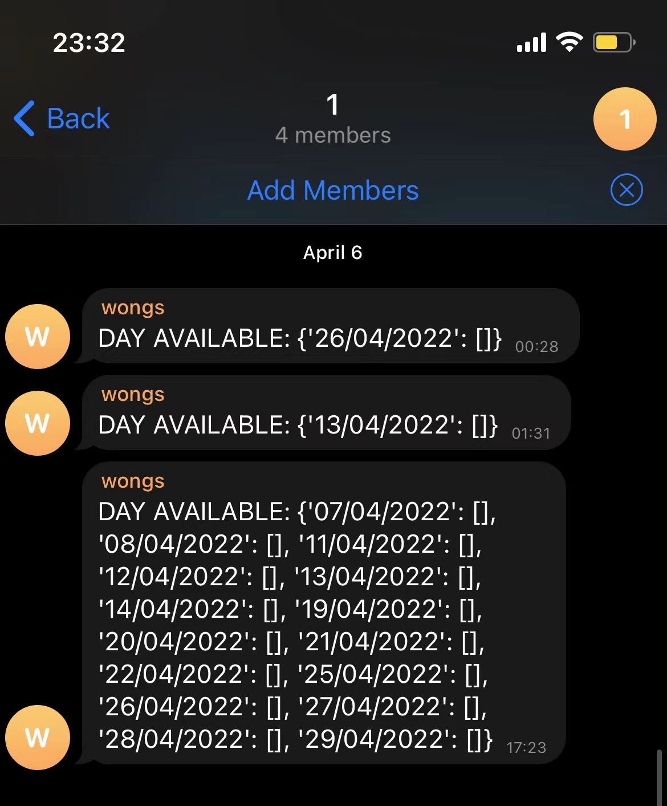

## 西班牙签证位置监听 (base英国)
### 一、简介
回国需要申根签，但是每天蹲网站刷slot太浪费时间了，故写了一个监听脚本。分享给在🇬🇧有需要的同学。

项目是基于 [one-focus/visa-spain](https://github.com/one-focus/visa-spain) 改的，抽出了关键代码，针对英国的BLS的网站改了一下。请不要拿来用作盈利用途，否则会追究责任。

在python3.6 + macOS Catalina上运行成功，没在别的环境上做过测试。

#### 功能
如果放了签证预约空位，你的telegram会收到机器人的信息。目前只通知日期，不会精确到小时，但个人用途足矣。

#### 效果



### 二、文件介绍
```text
.
├── monitor.py         # starter
├── visa.py            # modify xpath for UK BLS
├── utils
│   ├── basic.py       
│   ├── config.py      # configuration, you have to change this file!
│   ├── decorators.py
│   └── log.py
├── requirements.txt   # pip install -r requirements.txt
└── readme.md
```

### 三、运行
1. 安装依赖
    ```shell
    pip install -r requirements.txt
    ```
2. 修改config.py

    签证中心是写死在代码里的，默认是曼城。
    ```python
    # 不改的话默认是机器人的ID, 用之前先发条消息给@wongs_bot, 不然机器人发不了消息给你
    # 也可把@wongs_bot拉群群里，CHAT_ID改成群组的ID
    CHAT_ID = 2129111169
    
    # 必改，下面两项为你登陆BLS的账号密码
    EMAIL = 'xxx' 
    PASSWORD = 'xxx' 
    
    # 必改，你BLS点了Book Appointment之后出现的页面
    OPENED_PAGE = 'xxx'
    ```

3. 运行
    ```shell
    python3 monitor.py
    ```
    机器人会先测试通知可达，之后有slot的话才会发通知给你。
